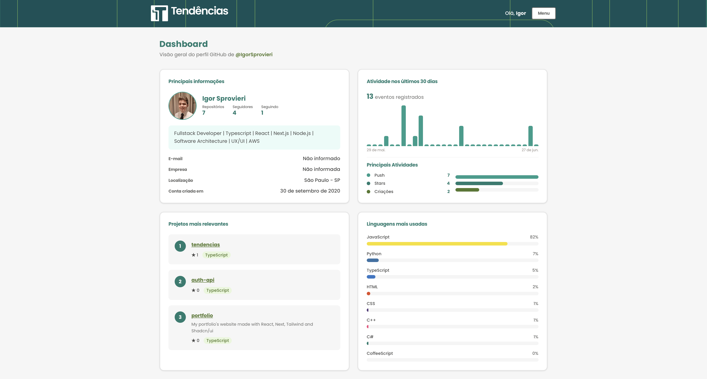

# Tendencias

Se cadastre, faça o login e veja o seu resumo do Github em um dashboard.



## Autor

Igor Sprovieri Pereira
+55 11 99761 2295
igor.sprovieri@outlook.com

## Solução proposta

O **Tendencias** centraliza, em um único dashboard, informações públicas do perfil GitHub associadas à conta do usuário na plataforma.

No fluxo principal, o usuário se cadastra informando nome, e-mail, senha e usuário do GitHub (`github_user`), faz login e acessa uma página autenticada que exibe:

- **Perfil** — avatar, bio, seguidores, repositórios públicos, localização e data de criação da conta;
- **Atividade** — gráfico dos últimos 30 dias e principais tipos de evento (push, PR, issues etc.);
- **Repositórios** — os três projetos com mais estrelas, com descrição e linguagem;
- **Linguagens** — distribuição percentual com base nos bytes dos repositórios analisados.

Os dados são obtidos pela API REST do GitHub, processados no backend NestJS e cacheados no Redis para melhorar performance e resiliência. Em falha da API externa, a aplicação tenta retornar dados em cache quando disponíveis.

A autenticação usa JWT com refresh token em cookies `httpOnly` (padrão BFF no Next.js), com senhas hasheadas em bcrypt. A arquitetura foi definida a partir de requisitos funcionais e não funcionais, com diagramas de casos de uso, classes e componentes disponíveis na seção [Arquitetura](#arquitetura).

## Produção

A aplicação está no Render e pode ser testada no link abaixo:

```
https://tendencias-4afb.onrender.com
```

- Para teste, pode ser usado o usuário `test@test.com.br` e a senha `Test123@`
- Render foi escolhido para deploy e armazenamento do projeto por ser uma escolha flexível e barato para testar MVPs, além da liberdade de configuração para rodar projetos monorepo.

## Arquitetura

A arquitetura foi montada utilizando requisitos funcionais e não funcionais, diagrama de casos de uso, diagrama de classes e diagrama de componentes.

```
https://www.figma.com/board/0yL5l0YvjRCHsVwWiQllLo/Consultoria?node-id=0-1&t=CWmPwv8POK0CNC0l-1
```

## Decisões técnicas

**Cache**

- Foi utilizado o Redis para cache das chamadas a API do Github, melhorando o tempo de resposta e experiência de usuário, além de reduzir chamadas ao banco de dados e evitar atingir o limite da api do github.

**Senhas**

- Hash com bcrypt (rounds configuráveis via `BCRYPT_ROUNDS`, padrão 12).
- Política de senha forte no registro: mínimo 8 caracteres, com maiúscula, minúscula e número.
- Proteção contra enumeração de usuários e timing attacks: no login, o bcrypt sempre é executado (mesmo quando o e-mail não existe) e a mensagem de erro é genérica ("Credenciais inválidas").
- Senha nunca é retornada pela API (`excludePassword` em todas as respostas com dados do usuário).
- Normalização de e-mail (`trim` + `toLowerCase`) no login e registro.

**Tokens**

- Access token JWT de curta duração (ex.: 15 min), assinado com `HS256`.
- Refresh token opaco (UUID) armazenado no Redis com TTL (ex.: 7 dias), permitindo revogação.
- Rotação de refresh token: ao renovar a sessão, o token antigo é consumido (uso único) e um novo é emitido.
- Logout revoga o refresh token no Redis e limpa os cookies no frontend.
- Validação do JWT a cada requisição protegida: expiração verificada e usuário revalidado no banco.

**Rate limiting**

- Registro: 3 requisições por hora.
- Login: 5 requisições por minuto.
- Refresh: 10 requisições por minuto.
- Limite global: 100 requisições por minuto.

**Frontend (BFF)**

- Tokens não são expostos ao JavaScript: login/registro passam pelas rotas `/api/auth/*` do Next.js, que armazenam os tokens em cookies e retornam apenas `{ user }`.
- Cookies `httpOnly`, `sameSite: lax` e `secure` em produção, mitigando XSS e CSRF.
- Middleware renova automaticamente o access token expirado e protege rotas autenticadas.

**Validação e configuração**

- ValidationPipe global na API com `whitelist` e `forbidNonWhitelisted`, descartando campos extras.
- Validação de variáveis de ambiente na inicialização (`JWT_SECRET` com mínimo de 16 caracteres, 32 em produção).
- Refresh token validado como UUID no DTO.

**Hardening HTTP**

- Helmet para cabeçalhos HTTP de segurança.
- CORS restrito à origem configurada (`CORS_ORIGIN`), com métodos e headers limitados.
- Autenticação stateless via JWT (`session: false` no Passport).

## Tecnologias utilizadas

**Monorepo e linguagem**

- [Node.js](https://nodejs.org/) (>= 18)
- [TypeScript](https://www.typescriptlang.org/)
- [pnpm](https://pnpm.io/) (gerenciador de pacotes)
- [Turborepo](https://turbo.build/) (orquestração do monorepo)

**Backend (API)**

- [NestJS](https://nestjs.com/)
- [Prisma](https://www.prisma.io/) (ORM)
- [PostgreSQL](https://www.postgresql.org/) (banco de dados)
- [Redis](https://redis.io/) + [ioredis](https://github.com/redis/ioredis) (cache e refresh tokens)
- [Passport.js](https://www.passportjs.org/) (`passport-jwt`, `passport-local`)
- [JWT](https://jwt.io/) (`@nestjs/jwt`, algoritmo HS256)
- [bcrypt](https://github.com/kelektiv/node.bcrypt.js) (hash de senhas)
- [class-validator](https://github.com/typestack/class-validator) e [class-transformer](https://github.com/typestack/class-transformer) (validação de DTOs)
- [Helmet](https://helmetjs.github.io/) (cabeçalhos HTTP de segurança)
- [@nestjs/throttler](https://github.com/nestjs/throttler) (rate limiting)
- [GitHub API](https://docs.github.com/en/rest) (dados de repositórios)

**Frontend (web)**

- [Next.js](https://nextjs.org/) (App Router, rotas `/api/auth/*` como BFF)
- [React](https://react.dev/)
- [TanStack Query](https://tanstack.com/query) (cache e fetching no cliente)
- [Tailwind CSS](https://tailwindcss.com/) (estilização)
- [Sonner](https://sonner.emilkowal.ski/) (notificações toast)

**Ferramentas de desenvolvimento**

- [Prettier](https://prettier.io/) (formatação)
- [ESLint](https://eslint.org/) (lint)

## Instalação e Execução

### Pré-requisitos

- [Node.js](https://nodejs.org/) >= 18
- [pnpm](https://pnpm.io/) (versão definida em `packageManager` na raiz do projeto)
- [Docker](https://www.docker.com/) e Docker Compose (para PostgreSQL e Redis locais)

### Infraestrutura local (Docker)

O repositório inclui um `docker-compose.yml` com PostgreSQL e Redis, alinhados ao `apps/api/.env.example`:

| Serviço    | Porta  | Credenciais                                              |
| ---------- | ------ | -------------------------------------------------------- |
| PostgreSQL | `5432` | usuário `postgres`, senha `postgres`, banco `tendencias` |
| Redis      | `6379` | sem autenticação                                         |

Suba os containers na raiz do projeto:

```bash
docker compose up -d
```

Para parar:

```bash
docker compose down
```

Os dados ficam persistidos nos volumes `postgres_data` e `redis_data`. Para remover os volumes junto com os containers:

```bash
docker compose down -v
```

### Instalação

Na raiz do repositório:

```bash
pnpm install
```

### Variáveis de ambiente

**API** — copie o exemplo e ajuste conforme necessário:

```bash
cp apps/api/.env.example apps/api/.env
```

Valores padrão do `.env.example`:

| Variável                 | Descrição                                                         |
| ------------------------ | ----------------------------------------------------------------- |
| `DATABASE_URL`           | Conexão PostgreSQL (padrão: `localhost:5432/tendencias`)          |
| `JWT_SECRET`             | Segredo para assinar JWTs (mín. 16 caracteres)                    |
| `JWT_EXPIRES_IN`         | Validade do access token (ex.: `15m`)                             |
| `JWT_REFRESH_EXPIRES_IN` | Validade do refresh token (ex.: `7d`)                             |
| `REDIS_URL`              | Conexão Redis (padrão: `redis://localhost:6379`)                  |
| `CORS_ORIGIN`            | Origem permitida no CORS (padrão: `http://localhost:3000`)        |
| `GITHUB_TOKEN`           | Token opcional da API do GitHub (aumenta o limite de requisições) |
| `BCRYPT_ROUNDS`          | Rounds do bcrypt (padrão: `12`)                                   |

**Web** — opcional em desenvolvimento. Sem `.env`, o frontend usa `http://localhost:3001` como URL da API:

```bash
# apps/web/.env
NEXT_PUBLIC_API_URL=http://localhost:3001
```

### Banco de dados

Com o PostgreSQL ativo (`docker compose up -d`), aplique as migrations:

```bash
pnpm --filter api prisma:migrate
```

### Desenvolvimento

Suba API e web juntos:

```bash
pnpm dev
```

Ou rode cada app separadamente:

```bash
pnpm dev:api   # API em http://localhost:3001
pnpm dev:web   # Web em http://localhost:3000
```

Acesse [http://localhost:3000](http://localhost:3000) no navegador.

### Produção local

```bash
pnpm build:api
pnpm build:dev
pnpm start:api:prod
pnpm start:web
```

## Rotas da API

Base URL em desenvolvimento: `http://localhost:3001`.

| Método  | Rota             | Autenticação | Descrição                                                                |
| ------- | ---------------- | ------------ | ------------------------------------------------------------------------ |
| `GET`   | `/`              | —            | Mensagem de boas-vindas da API                                           |
| `GET`   | `/health`        | —            | Health check (`{ status: "ok" }`)                                        |
| `POST`  | `/auth/register` | —            | Cadastro de usuário (nome, e-mail, senha, `github_user`)                 |
| `POST`  | `/auth/login`    | —            | Login com e-mail e senha; retorna tokens e dados do usuário              |
| `POST`  | `/auth/refresh`  | —            | Renova access token a partir do refresh token (rotação de refresh token) |
| `POST`  | `/auth/logout`   | —            | Revoga o refresh token no Redis (`204 No Content`)                       |
| `GET`   | `/auth/me`       | JWT          | Retorna o usuário autenticado                                            |
| `PATCH` | `/auth/me`       | JWT          | Atualiza `name` e `github_user` do perfil                                |
| `GET`   | `/github`        | JWT          | Retorna dados agregados do GitHub do usuário (perfil, repos, atividade)  |

## Páginas da Web

Base URL em desenvolvimento: `http://localhost:3000`.

### Páginas

| Rota        | Acesso      | Descrição                                                      |
| ----------- | ----------- | -------------------------------------------------------------- |
| `/`         | Autenticado | Dashboard com resumo do perfil GitHub do usuário               |
| `/login`    | Visitante   | Formulário de login; redireciona para `/` se já autenticado    |
| `/register` | Visitante   | Formulário de cadastro; redireciona para `/` se já autenticado |

O middleware do Next.js protege rotas autenticadas, renova o access token expirado automaticamente e redireciona visitantes não autenticados para `/login`.

### Rotas BFF (`/api/auth/*`)

O frontend não expõe tokens ao JavaScript. Login, registro e sessão passam pelas rotas abaixo, que armazenam tokens em cookies `httpOnly` e retornam apenas `{ user }` quando aplicável.

| Método  | Rota                 | Descrição                                         |
| ------- | -------------------- | ------------------------------------------------- |
| `POST`  | `/api/auth/register` | Proxy de cadastro; define cookies de autenticação |
| `POST`  | `/api/auth/login`    | Proxy de login; define cookies de autenticação    |
| `POST`  | `/api/auth/logout`   | Revoga sessão e limpa cookies                     |
| `POST`  | `/api/auth/refresh`  | Renova tokens via refresh token nos cookies       |
| `PATCH` | `/api/auth/me`       | Atualiza perfil do usuário autenticado            |
